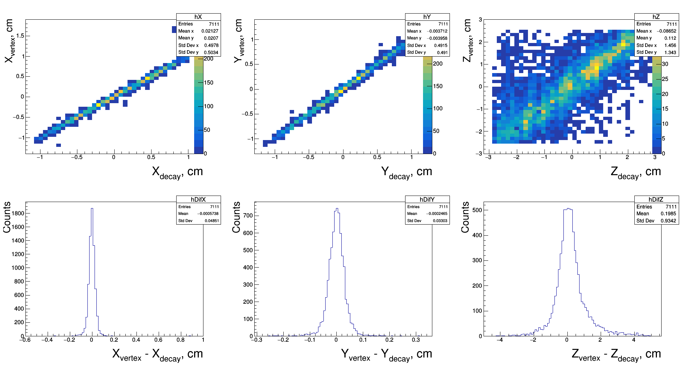

Running simulation and digitization with ALPIDE detectors.

1. Run docker container (see main [README](../../README.md), step 5).

2. The geometry files should be already included in the repository. In case something is wrong, create geometry file for the target and the box with ALPIDE detectors:
```
cd /opt/er/macro/geo
root -b -q create_target_9Be_geo.cpp
root -b -q create_Alpide_geo.cpp
```
3.
Run the simulation and digitization:
```
cd /opt/er/macro/Alpide
root -l sim.C
root -l digi.C
```
4. Running `root -l analysis/draw.C` should yield the spectra similar to the following:

