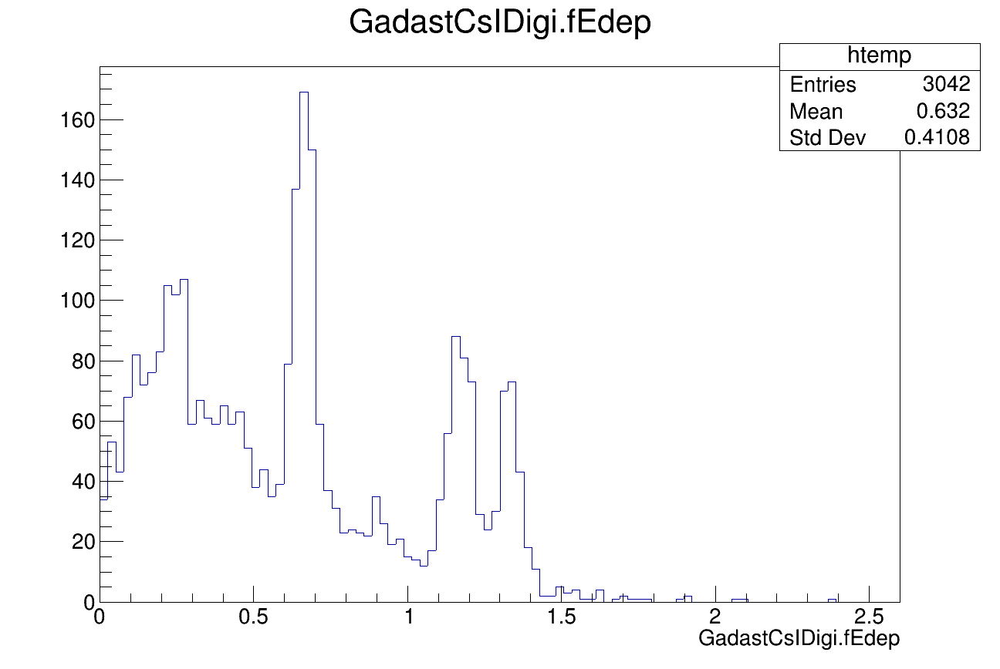

Here is an example of GADAST simulation and digitization, reproducing the test experiments, conducted in Warsaw, November 2021. 
1. Run docker container (see main [README](../../README.MD), step 5)

2. One can run the given bash script and then will be prompted to run either a simulation, digitization or both in succession.
```
./script_sim_digi.sh
#Press 3
```
3. In the created `digi_test.root`, `fGadastCsIDigi.fEdep` branch, one should see a spectrum, similar to:


